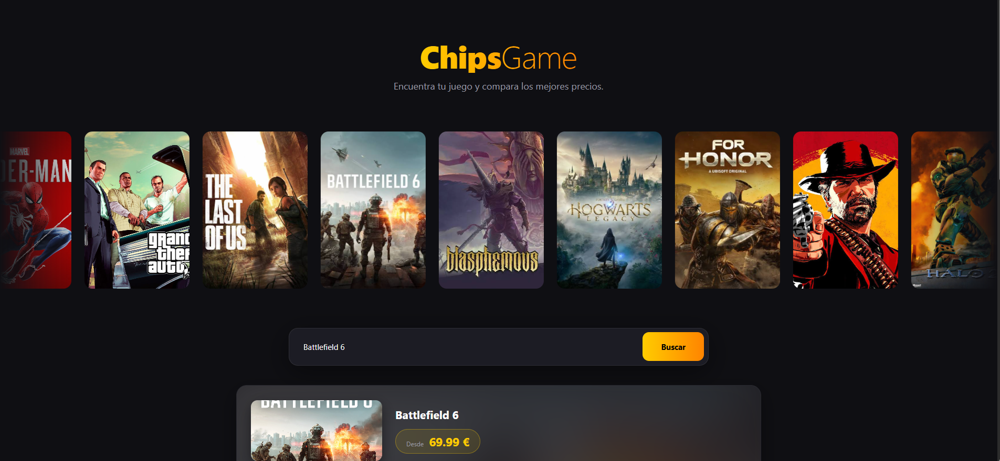

# ChipsGame

Comparador de precios de videojuegos: busca un juego y ve en qué tienda está más barato.

**Demo:** [https://chipsgame.onrender.com/](https://chipsgame.onrender.com/)
> La demo está en un plan gratuito que se "duerme" tras 15 minutos sin visitas. La primera carga puede tardar cerca de un minuto; después va con normalidad.



## Qué hace

- Busca juegos por título y muestra el precio en varias tiendas (Steam, GOG, Epic Games, Humble Store, Fanatical...).
- Resalta la **mejor oferta** de cada juego y ordena las tiendas de la más barata a la más cara.
- Carrusel infinito de juegos destacados: al pulsar una portada se busca esa oferta.
- Diseño oscuro y responsive, con paleta amarillo-naranja definida en variables CSS.

## Tecnologías

| Parte | Tecnología |
| --- | --- |
| Frontend | HTML, CSS y JavaScript (sin frameworks) |
| Backend | Node.js, Express 5 |
| Base de datos | MySQL (`mysql2`) |
| Datos de precios | [CheapShark API](https://apidocs.cheapshark.com/) |
| Otras librerías | axios, cors, dotenv |

## Cómo funciona

1. El navegador llama a `GET /api/buscar-juego/:titulo`.
2. El servidor consulta CheapShark, guarda los juegos y sus precios en MySQL y devuelve los ids internos.
3. Para pintar cada tarjeta, el navegador llama a `GET /api/comparar/:id`, que solo lee de MySQL y devuelve las ofertas ordenadas por precio.

### Decisiones técnicas

- **Una fila por juego y tienda:** la tabla `precios` tiene una clave `UNIQUE (juego_id, tienda_id)` y el servidor usa `INSERT ... ON DUPLICATE KEY UPDATE`, así que los precios se actualizan en vez de duplicarse.
- **Caché en memoria:** una búsqueda repetida no vuelve a llamar a CheapShark (30 min), y los precios de un juego se refrescan como máximo cada 6 horas.
- **Respeto al límite de peticiones:** si CheapShark limita las llamadas, el servidor deja de consultarlo durante unos minutos y responde con los juegos que ya tiene guardados en MySQL.
- **Seguridad básica:** los textos que llegan de la API se escapan antes de pintarlos en el HTML, y las credenciales viven en variables de entorno.
- **Accesibilidad:** las portadas del carrusel son botones que se pueden usar con teclado, y se respeta `prefers-reduced-motion`.

## Estructura del proyecto

```
├─ bbdd/                 Script SQL de la base de datos
├─ src/
│  ├─ config/db.js       Conexión a MySQL (pool)
│  ├─ public/            Frontend (index.html, style.css, img/)
│  └─ index.js           Servidor Express y API
├─ .env.example          Variables de entorno de ejemplo
├─ package.json
└─ README.md
```

## Ejecutarlo en local

Necesitas Node.js 18 o superior y MySQL.

```bash
# 1. Clona el repositorio e instala las dependencias
git clone https://github.com/TU_USUARIO/chipsgame.git
cd chipsgame
npm install

# 2. Crea la base de datos: ejecuta el script de la carpeta bbdd/ en MySQL

# 3. Crea tu archivo de entorno y rellénalo
cp .env.example .env

# 4. Arranca el servidor
npm run dev      # con recarga automática (nodemon)
# o bien
npm start
```

Abre http://localhost:3000

### Variables de entorno

| Variable | Descripción | Ejemplo |
| --- | --- | --- |
| `PORT` | Puerto del servidor | `3000` |
| `DB_HOST` | Host de MySQL | `localhost` |
| `DB_PORT` | Puerto de MySQL | `3306` |
| `DB_USER` | Usuario | `root` |
| `DB_PASSWORD` | Contraseña | |
| `DB_NAME` | Nombre de la base de datos | `comparador_juegos` |
| `DB_SSL` | `true` si tu proveedor exige conexión segura | `false` |

## API

| Método | Ruta | Descripción |
| --- | --- | --- |
| GET | `/api/buscar-juego/:titulo` | Busca en CheapShark (hasta 5 juegos), guarda precios y devuelve los ids internos |
| GET | `/api/comparar/:id` | Devuelve el juego, su portada y todas las ofertas ordenadas de menor a mayor precio |

## Despliegue

Pensado para alojarse de forma gratuita:

- **Aplicación (backend + web):** [Render](https://render.com) como *Web Service* (`npm install` y `npm start`).
- **Base de datos:** MySQL gratuito en [Aiven](https://aiven.io).

## Próximas mejoras

- Enlaces directos a la oferta en cada tienda.
- Historial de precios y gráfica por juego.
- Límite de peticiones por IP en la API.
- Caché persistente en la base de datos.

## Créditos

Los precios proceden de la [API de CheapShark](https://apidocs.cheapshark.com/). Los nombres y las portadas de los juegos pertenecen a sus respectivos propietarios. Proyecto personal de portfolio.